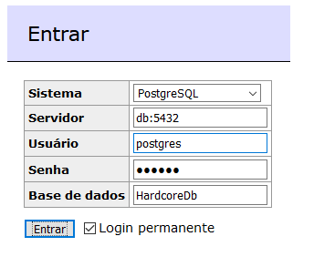

# Aula 02

Nessa aula vamos fazer um DER a partir de uma base já criada.

## Como rodar e acessar ambiente:

1. Abrir Poweshell ou Command Prompt. Pressione as teclas **windows** + **x**;
2. Navegar até o repositório, pasta Aula 02;

    ```powershell
    cd 'Database\Aula 02'
    docker-compose up --build
    ```

3. Abrir navegador e acessar endereço do [adminer](http://localhost:8080);
4. Configurar sistema como: **PostgreSQL**;
5. Configurar servidor como: **db:5432**;
6. Configurar usuário como: **postgres**;
7. Configurar senha como: **1234567**;
8. Configurar base de dados como: **HardcoreDb**;

    

## Exercício:

Desenhe o DER referente a base de dados HardcoreDb, inserindo as entidades, atributos, restrições e relações;

