# Banco de dados

Material destinado a turma de banco de dados da UniFESO.

Para começar, é necessário baixar e instalar os recursos necessários para as aulas.

## Como instalar recursos necessários

### Git

* Fazer download do [Git](https://git-scm.com/download/win)
* Baixa pelo link:

    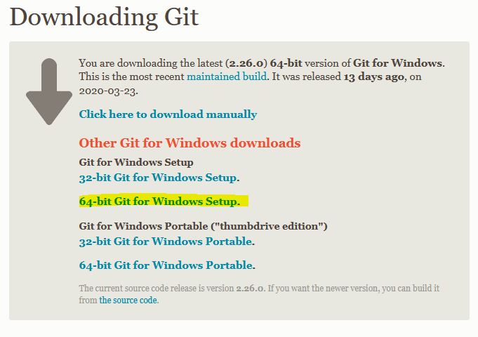

* Seguir passo a passo:

    1. 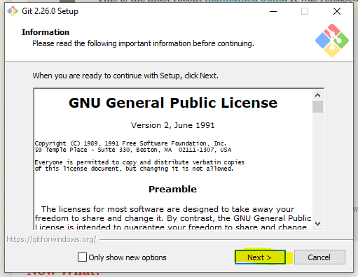
    2. 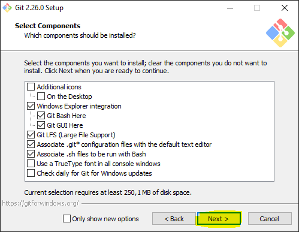
    3. 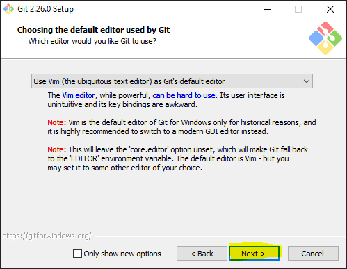
    4. 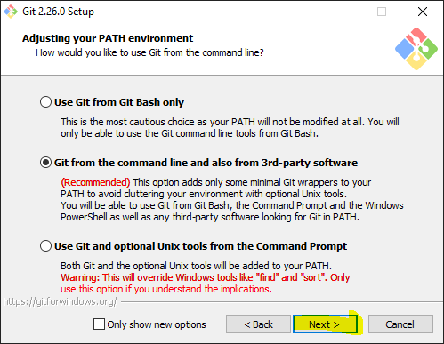
    5. 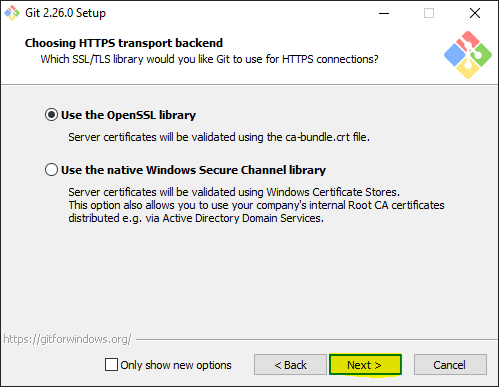
    6. 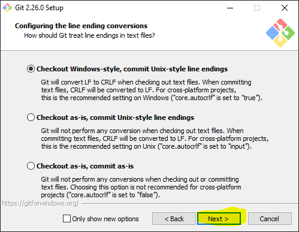
    7. 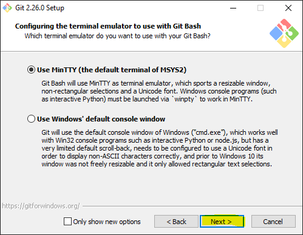
    8. 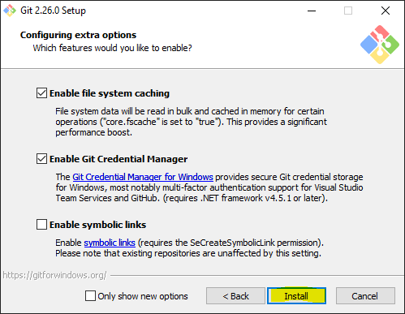
    9. 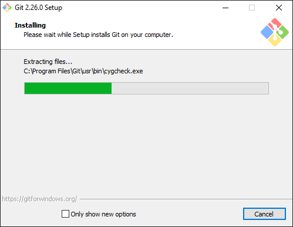
    10. 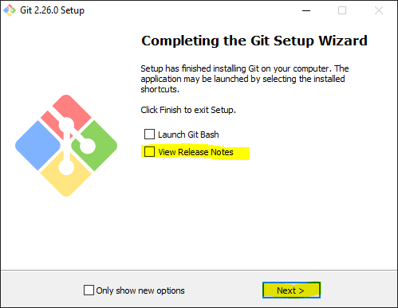

### Docker

* Fazer download do [Docker para Windows](https://hub.docker.com/editions/community/docker-ce-desktop-windows/)

    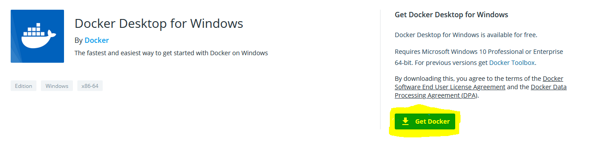

* Seguir passo a passo:
    
    **Pode acontecer de pedir para habilitar o Hyper-V no windows, caso seja requisitado, permita que habilite. Com isso o computador será reiniciado.**

    1. 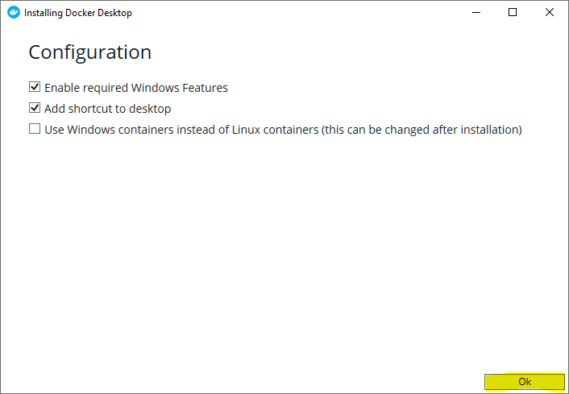
    2. 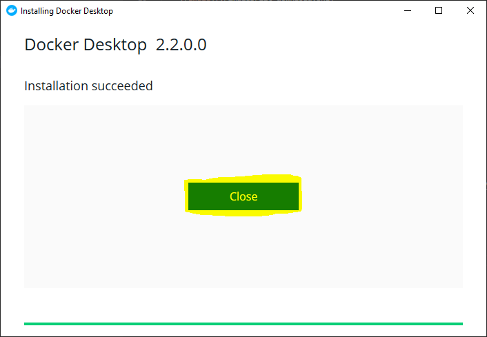
    3. Inicie o programa.

* Fazer download do repositório:

    1. Abrir Poweshell ou Command Prompt. Pressione as teclas **windows** + **x**;

    

    2. Baixa repositório;
        
        ```powershell
        git clone https://github.com/tiagor87/Database.git
        ```

        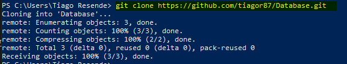

    3. Acessar pasta;

        ```powershell
        cd Database
        ```

### StarUML

* Fazer download do [StarUML](http://staruml.io/download)

    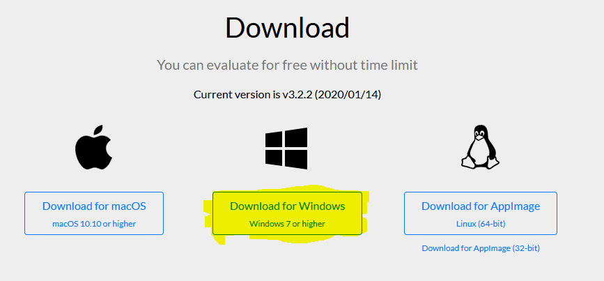

